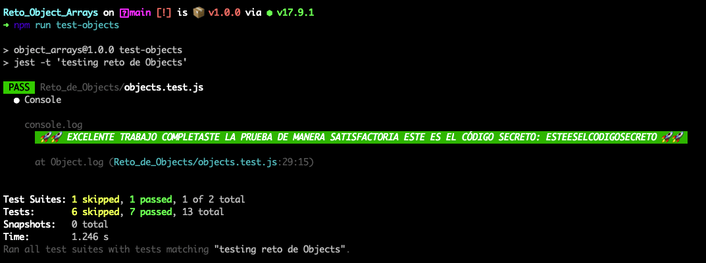
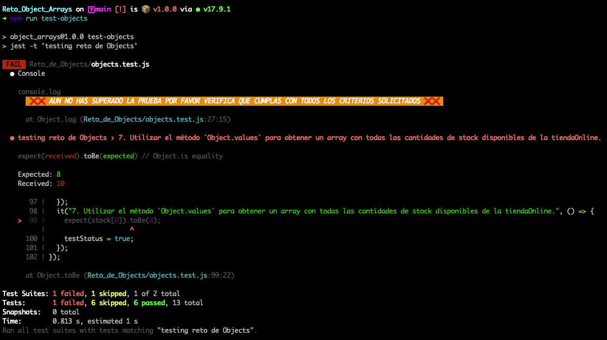

# 🤓 Reto UBITS

Bienvenido a tu reto de llamado API's y manipulación del DOM en Javascript para nosotros es un gusto que puedas poner a prueba tus los conocimientos que vienes aprendiendo en nuestros curso de Javascript.

## ☑️ Requisitos para realizar el reto

- tener instalado node v16 o superior
- tener instalado npm 8 o superior
- tener un un powerShell o shell con el cual ejecutar lineas de comandos
- tener un editor de código donde realizar el reto (ej: visual studio code)
- tener cuenta de gitHub activa

## ⏲ Setup del reto

Para poder solucionar este reto de una manera correcta debes seguir los siguientes pasos:

### 1. Clonar el reto localmente

Primero debes clonar el reto en tu maquina para que puedas acceder a la información del reto y su estructura, para esto escribe el siguiente comando en tu shell:

**Si tienes configurada una llave SSH**

```bash
git clone git@github.com:buty619/Reto_APIs_DOM.git
```

**para clonarlo por HTTPS**

```bash
git clone https://github.com/buty619/Reto_APIs_DOM.git
```

### 2. Instalar dependencias

luego de clonarlo accede a la carpeta que acabas de clonar e instala las dependencias necesarias para el reto (si no conoces el concepto de dependencias no te preocupes no es necesario conocer su funcionamiento para resolver el reto) para esto escribe en tu shell:

```bash
cd Reto_APIs_DOM
```

```bash
npm install
```

✅ listo con estos pasos estas listo para iniciar tu reto mucha suerte ¡¡¡

### 🗒 Estructura del reto

En este repositorio encontraras dos carpetas, la primera [Reto_de_llamada_APIs](https://github.com/buty619/Reto_APIs_DOM/tree/main/Reto_de_llamada_APIs) contiene 3 archivos:

- **README.md**: este archivo contiene las instrucciones para resolver el reto por favor léelo cuidadosamente.
- **api.js**: en este archivo colocaras el código con el cual resuelvas el reto, dentro del archivo encontraras algunas pistas e instrucciones.
- **api.test.js**: este archivo es el que prueba que hayas resuelto el reto correctamente (no te preocupes por entender este código mas adelante podrás estudiar el concepto de test unitarios).

En la segunda capeta [Reto_de_manipulacion_DOM](https://github.com/buty619/Reto_APIs_DOM/tree/main/Reto_de_manipulacion_DOM) contiene varias carpetas y archivos:

- **README.md**: este archivo contiene las instrucciones para resolver el reto por favor léelo cuidadosamente.
- 📁 **css**: contiene el archivo con los estilos de nuestra aplicación no realizaremos ninguna modificación en este archivo.
- 📁 **img**: contiene assets que usamos en nuestro reto no realizaremos ninguna modificación en este folder.
- 📁 **js**: en este archivo colocaras el código con el cual resuelvas el reto, dentro del archivo encontraras algunas pistas e instrucciones.
- **dom.test.js**: este archivo es el que prueba que hayas resuelto el reto correctamente (no te preocupes por entender este código mas adelante podrás estudiar el concepto de test unitarios).
- **index.html**: este archivo contiene la estructura del DOM el cual vamos a manipular no realizaremos ninguna modificación en este archivo.

ademas de estas carpetas podrás ver otros archivos como:

- .gitignore
- babel.config.json
- package.json

no te preocupes por estos archivos ellos realizan un trabajo de configuración de nuestro reto y no es necesario profundizar en ellos.

### 🚀 ¿Como saber si complete el reto?

luego que hayas leído las instrucciones y hayas puesto a prueba todo tu conocimiento la manera correcta de saber si resolviste el reto es escribiendo estos comandos en tu shell:

Para el reto de llamas a APIs, escribe:

```bash
npm run test-api
```

Para el reto de manipulación del DOM, escribe:

```bash
npm run test-dom
```

para ambos casos se correrán los test de tu código donde si tienes correctamente solucionado podrás ver un mensaje como:

<p align="center">
  
</p>

si por el contrario tienes algún error verás un mensaje como:

<p align="center">
  
</p>

en caso de completar la prueba exitosamente podrás ver el mensaje mencionado el cual expondrá un código secreto el cual podrás usar para validar la solución en nuestra plataforma UBITS.

### 🥳 ¡Buena suerte! 🥳
